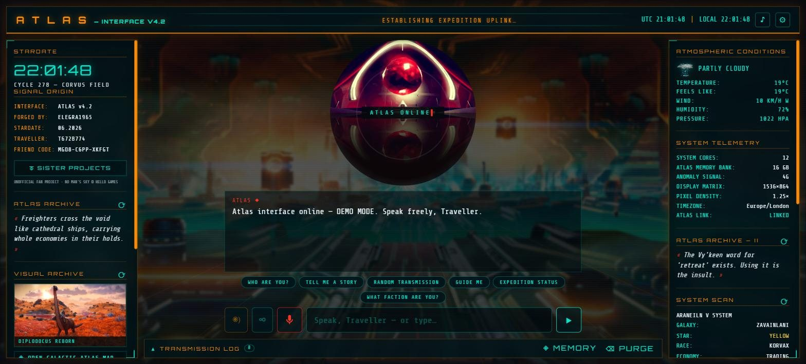
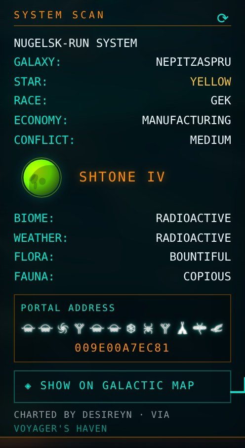
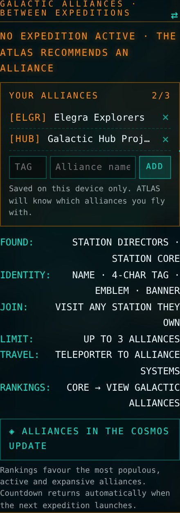

# ATLAS — No Man's Sky AI Interface

**Live:** [atlas.nomansskyhub.app](https://atlas.nomansskyhub.app)

A voice-first AI companion themed on *No Man's Sky*. Speak to the Atlas and it speaks back, with a live HUD around it: the current expedition, real community-charted worlds, your local weather and lore from across the universe. Free demo mode for everyone; add your own Anthropic API key for full conversation.

Part of the [No Man's Sky Hub](https://nomansskyhub.app) family of fan tools.

## Highlights (v4.4)

- **Atlas Codex:** ask how to craft or refine anything, where to find it, or what an item is used for — real recipes and sources read live from the [No Man's Sky Wiki](https://nomanssky.fandom.com), no API key needed
- **Expedition guide:** every milestone of the current expedition by phase, with hints and rewards
- **Voice in, voice out**, with wake word, continuous mode, hold-to-talk and interruptions
- **Long-term memory** of what you tell it about yourself, stored only in your browser
- **Live expedition ticker and countdown** from the official Galactic Atlas feed. It finds new expeditions by itself
- **Galactic Alliances tile** with the live top 5 in the left panel (on phones it sits where the Visual Archive was; both archives now share one tile)
- **Live alliance leaderboard ticker** under the expedition ticker: the top 10 Galactic Alliances with members, stations and 24-hour changes, plus where your own alliances rank. Leaderboard courtesy of [Voyager's Haven](https://havenmap.online), built by [u/IAmThe-Ekimo-1920](https://www.reddit.com/user/IAmThe-Ekimo-1920/)
- **Real worlds in the System Scan.** Planets charted by players on [Voyager's Haven](https://havenmap.online), with portal address, discoverer and a link to the [Galactic Map](https://map.nomansskyhub.app)
- **Galactic Alliances.** Between expeditions the countdown panel becomes an alliances briefing. Log up to three of your own alliances and ATLAS knows who you fly with
- **Phone-friendly**, with arrows that show when a tile strip scrolls sideways

  
  

## Where the code is

The whole site lives in [`atlas-nms-assistant/`](atlas-nms-assistant/). That folder's [README](atlas-nms-assistant/README.md) covers setup, controls, voices, the API key and every file. Netlify publishes that folder on every push to `main`.

## Licence

The code is MIT licensed (see `atlas-nms-assistant/LICENSE`). Game names and imagery belong to Hello Games and are not covered by that licence.

*An unofficial, fan-made project. Not affiliated with, sponsored by, or endorsed by Hello Games or Anthropic.*

## Credits

- Live expedition data: the official Galactic Atlas API by Hello Games
- Recipes, sources and expedition milestones: the [No Man's Sky Wiki](https://nomanssky.fandom.com) community (CC BY-SA)
- Real worlds and the alliance leaderboard: [Voyager's Haven](https://havenmap.online), built and run by [u/IAmThe-Ekimo-1920](https://www.reddit.com/user/IAmThe-Ekimo-1920/). Thanks for opening up the Haven API. Haven's data belongs to Haven and its contributors.

Built by elegra1965.
